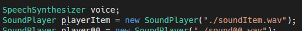
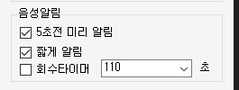
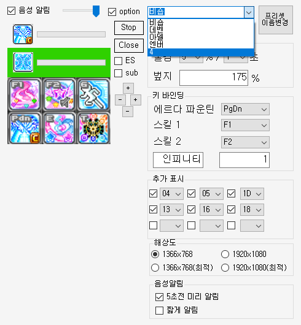

# 사용 전 주의사항
- 해당 프로그램을 사용함에 있어 발생할 수 있는 모든 사항은 사용자 개인의 책임입니다.
- 해당 프로그램을 사용하여 발생하는 모든 사항에는 개발자는 책임이 없음을 알려드립니다.

# 프로그램의 권한
- 해당 프로그램은 타 프로세스(MapleStory)에 접근하여 화면을 Read합니다. 
    - Discord의 화면 공유와 같은 권한
    - 이미지 검출용
- 해당 프로그램은 키보드의 입력을 확인합니다.
    - 게임 키뷰어와 같은 권한
    - 키를 입력받아 마지막 입력된 key의 시간을 검출하기 위함.

# Issue
비 개발자의 경우 닷넷프레임워크(.Net Framework)가 설치되어 있지 않을 수 있습니다.

이 경우 프로그램이 실행되지 않을 수 있습니다.

관련된 오류가 발생하는 경우 [link](https://dotnet.microsoft.com/ko-kr/download/dotnet-framework/net472)에서 다운로드 받으시면 해결됩니다.

화면이 제대로 나오지 않을 경우 디스플레이 -> 배율 및 레이아웃 -> 텍스트, 앱 및 기타항목의 크기 변경 이 100%가 맞는지 확인해주세요

# 사용방법
1. 처음 프로그램을 켜면 같은 폴더 내 config라는 파일이 생성됩니다.
해당 파일은 설정값을 개인에 맞게 저장하는 파일입니다.
기본적으로 해당 프로그램은 본캐가 비숍인 개발자에 맞게 제작되어있습니다.

2. option 좌측 checkbox를 눌러 초기 옵션을 설정합니다.

3. 본인의 상황에 맞게 쿨감, 벞지를 설정합니다.
- 쿨감의 경우 에르다파운틴 재설치 시간 알림에 영향을 미칩니다.
- 벞지의 경우 추가 버프 스킬의 지속시간에 영향을 미칩니다.

4. 에르다 파운틴은 설치기로 사용하도록 미리 마우스 우클릭을 통해 설정해주세요

5. 스킬 1과 스킬 2는 모두 버프스킬의 재사용 알림 시간을 초기화시킵니다. 언스테이블메모리를 고려하여 구현되어있기 때문에 필요 없는 경우 스킬 1과 스킬 2를 같은 버튼으로 설정해두면 됩니다.

6. [인피니티] 에 적힌 글씨는 음성 알림시에 사용됩니다. 이상한 글씨를 적을 경우 오류를 발생시킬 수 있습니다.

7. 예시의 40은 버프의 기본 지속시간을 의미합니다. 예를들어 쓸만한 스킬의 경우 180을 입력하면 됩니다.

8. 기본으로 인피니티가 아이콘으로 설정되어있으나, icon.png의 이름으로 같은 폴더내 다른 이미지가 들어있을 경우 해당 아이콘이 설정됩니다.

(재획비 이미지를 icon.png로 변경하여 폴더에 넣은 경우.)

9. 추가 표시는 좌측에 표시할 퀵슬롯창 아이콘의 표시 여부와 위치입니다.
아래 이미지를 참조하여 위치를 설정하면 됩니다.

 

10. 상단 slide bar를 움직이면 투명도를 조절할 수 있습니다.

11. 해상도를 바꾸면 맞게 퀵슬롯을 조절할 수 있습니다.

12. 창을 움직이고 싶으면 바탕으로 보이는 아무 위치를 클릭 후 드래그 하면 됩니다.

13. Stop 으로 타이머를 멈출수 있으며, Close로 창을 종료할 수 있습니다.

14. sub에 체크할 경우 창이 1개 더 load됩니다. 기본 창의 모든 기능을 복제하며,
듀얼모니터 유저를 위해 양쪽에 모두 Timer를 켜고 싶은 경우 사용하면 됩니다.

15. ES check box를 check할 경우 필요한 이미지를 제외하고는 모두 투명화 됩니다.
또한, 마우스 클릭을 통해 창을 움직일 수 없게 됩니다.

16. 시간이 거의 만료되면 배경이 붉게 변하며, 시간이 모두 종료될 경우 음성으로 알림이 울립니다.

# Release Note
[v0.10]
- **이번 업데이트 시 config파일을 삭제후 사용해주세요**
- preset 변경 시 sound, resolution, offset등 공용으로 적용되어야 한다고 판단되는 부분들을 공용으로 변경 가능하도록 추가했습니다.
- 회수 타이머를 추가했습니다. 켜지자마자 timer는 동작하고, check여부에 따라 알림을 울리지 판단하게 되므로, 첫 알림의 duration은 보장하지 않습니다. 다른 기능들과 마찬가지로 custom voice 기능이 있습니다.(test는 해보지 않음)

- 일부 벞지를 사용할 때 progress bar의 수치에 따라 발생하던 오류를 수정했습니다. ("256"의 값을 'green'에 사용할 수 없습니다 오류)

[v0.9]

- preset 변경 시 일부 race condition으로 인해 중도 저장되며 잘못된 값이 저장되던 문제를 해결했습니다. 이제 원래 의도대로의 preset으로 동작합니다.
- 이제 키보드 입력은 메이플 창 내부에서만 받습니다. 다만, 외부 채팅창의 경우에도 메이플로 인식되므로, 메이플 내부에서는 언제나 입력받는다고 생각하시면 됩니다.

- 음성을 세분화하여 입력할 수 있도록 하였습니다. 각 숫자는 {preset number}{skill number} 이므로 sound31.wav 파일의 경우에는 4번째 preset(0부터 시작하므로.)의 두번째 skill에 해당하는 음성 파일입니다.
**해당 기능은 테스트해보지 못했으므로, 버그가 있을 수 있습니다.**

[v0.8]

- 여러 캐릭터에 적용이 필요한 경우를 위해 config값을 최대 5캐릭터에 해당하도록 변경이 가능하도록 수정했습니다.
테스트는 많이 하진 않았지만 대략 동작하는 것 같아 우선 릴리즈합니다!
- 추가로 음성이 불호라는 요청이 있어 tool과 같은 폴더에 sound.wav라는 이름의 파일이 있으면 목소리 대신 해당 음악을 재생하도록 하였습니다.(ex. 띵동~ 이런거 넣으시면 됩니다.)

[v0.7]

- 해상도 설정이 기본 값이 아닌 경우 발생하는 memory에러를 수정했습니다.
함수 로드를 한번 덜 했네요..
추가로 해상도별 최적 비율의 설정도 했습니다...만... 최적비율이 의미하는 바가
제가 생각한 것과 다르다면 이상하게 동작 할 수 있습니다. 사용해보시고 알려주세요.
기존 offset 조정으로 좌표를 변경하셨던 경우 오동작 할 수 있으므로, config파일을 지우고 새로 생성 하시는 것을 추천드립니다.
- Window 11 사용자에게서 발생하던 Crash가... 아마? 잡혔습니다.

[v0.6]
- 일부 사용자에게서 발생한 화면 밀림 현상을 보정하기 위해 좌표 offset 보정 버튼을 만들었습니다. 해당 좌표로 반영된 결과도 그대로 config에 반영되기에, 추후 버그 offset이상이 발생되었다 판단이 되실 경우 config파일을 지우고 시도해주세요

[v0.5]
- Config 저장 관련 순서가 잘못되어, 정상적으로 저장되지 않던 문제가 수정되었습니다.
config data는 값이 변경될 때 마다 저장됩니다.
(버그 수정에 도움을 주신 인벤닉 : 경경이님 감사합니다.)
- 아이콘의 배경이 투명해졌습니다.
(투명 파일 제공해주신 인벤닉 : 유니쿠님 감사합니다.)
- key bind에 ALT를 추가했습니다. 모든 alt, shift, control은 좌측키만 해당됩니다.

[v0.4]
- config load후 data가 progress bar에 적용되지 않아 발생한 문제를 수정했습니다.
- 재사용 대기시간 감소 % 효과에 10, 11, 15, 16 %를 추가했습니다.(프리드용)

[v0.3]
- 에르다파운틴을 (없음) 으로 선택할 경우 관련 UI가 사라집니다.
- 스킬 1과 스킬 2를 모두 (없음) 으로 선택할 경우 관련 UI가 사라집니다.

- 음성 알림옵션 중, 5초 전 미리 알림, 짧게 알림 기능이 추가되었습니다.
- 키보드 선택에 좌측 CTRL과 좌측 SHIFT가 추가되었습니다.

# 추후 개발 예정 사항 (일정 미정)
- 